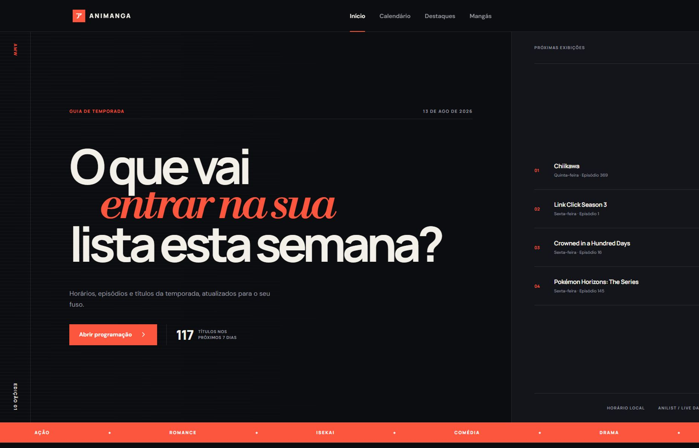
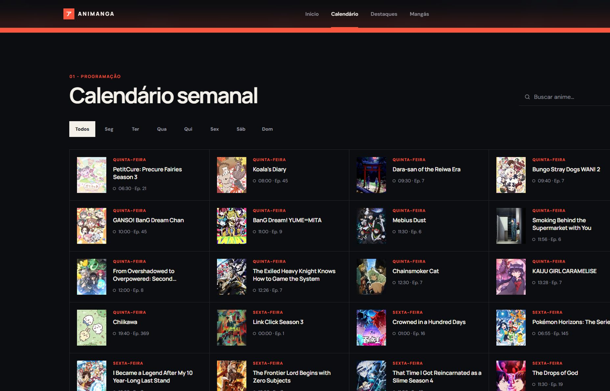
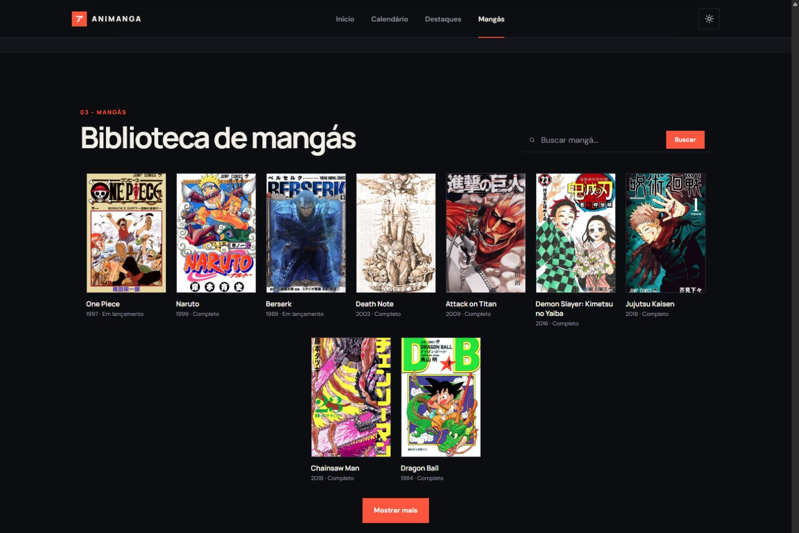
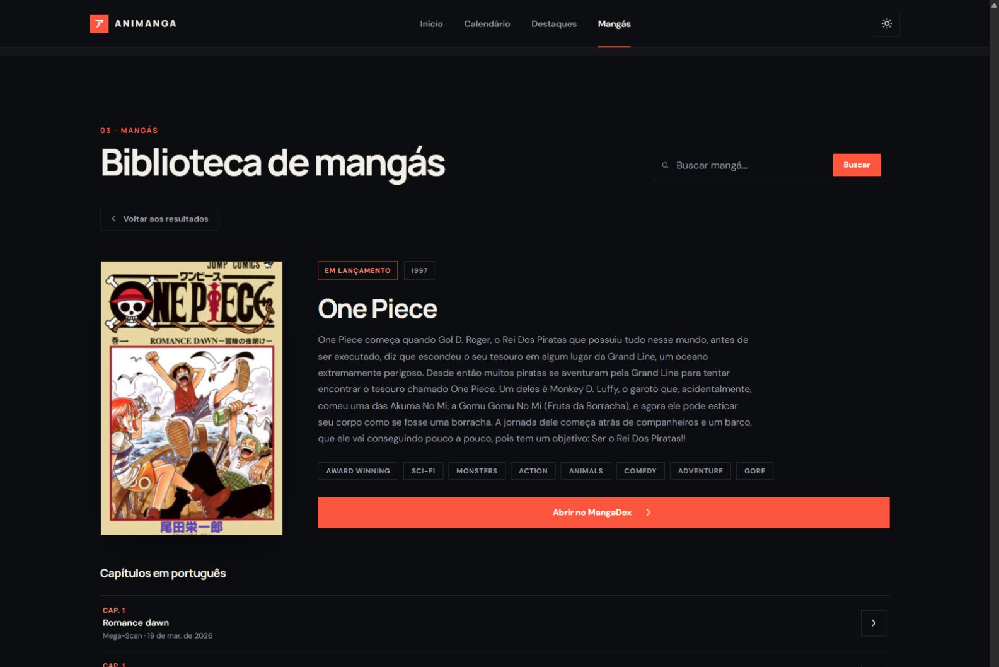
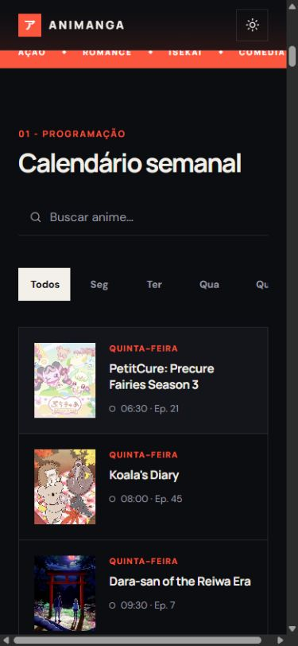
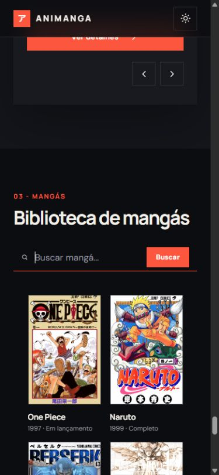
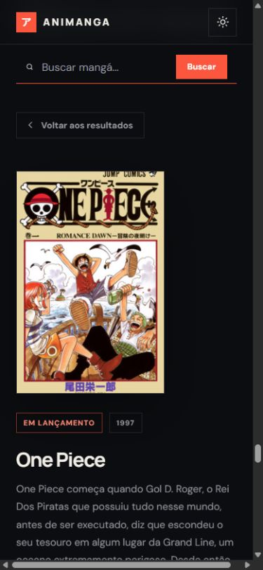

# Animanga Wiki

Animanga é um guia de temporada de animes e mangás. O front-end é feito com HTML, CSS e JavaScript puro e roda no
navegador. Um back-end em Node.js e Express fica entre o navegador e as APIs externas (AniList, Jikan e MangaDex):
ele protege essas APIs contra excesso de requisições, guarda as respostas em cache com reserva da última resposta
boa e traduz descrições automaticamente. O navegador só conversa com a própria origem (`/api`).

A página consulta dados públicos, monta uma programação para os próximos dias, permite pesquisar e filtrar títulos,
apresenta destaques da temporada e permite buscar mangás com capítulos em português.

## Projeto publicado

🌐 [Acesse o Animanga Wiki](https://animanga-wiki.onrender.com)

## Visualização do projeto




### Calendário semanal



### Biblioteca de mangás



### Detalhes e capítulos



### Interface responsiva

<p align="center">
  
  
</p>

<p align="center">
  
  
</p>

## Funcionalidades

- programação de animes dos próximos sete dias, servida pelo back-end (AniList, com a programação da Jikan como
  fallback);
- horários convertidos para o fuso local de quem acessa quando a agenda vem do AniList (o back-end envia o
  timestamp Unix e a conversão acontece no navegador);
- filtro por todos os dias ou por um dia específico;
- busca de títulos de anime tolerante a maiúsculas, minúsculas e acentos;
- lista das quatro próximas exibições no hero;
- destaques da temporada ordenados por nota;
- navegação circular entre destaques;
- remoção de animes e imagens repetidos feita no back-end;
- sinopses locais em português para IDs cadastrados;
- fallback para a sinopse da API ou mensagem padrão;
- biblioteca inicial com uma seleção editorial de 20 mangás conhecidos, já visível ao abrir a página, mostrando
  oito de início e o restante sob demanda pelo botão "Mostrar mais";
- biblioteca inicial funcionando mesmo com o back-end desligado, com os cards levando à página pública do
  MangaDex nesse caso;
- busca de mangás no MangaDex, com ficha de detalhe e capítulos paginados em português;
- tradução automática das descrições de mangá para português quando o MangaDex não fornece uma versão em pt-br;
- tema claro e escuro salvo no navegador;
- estados de carregamento, vazio, erro e nova tentativa;
- layout adaptado para celular, desktop e telas muito grandes;
- recursos de acessibilidade, como HTML semântico, skip link, ARIA, navegação por teclado nas abas de dia e redução
  de movimento.

## Tecnologias

Front-end:

- HTML5 semântico;
- CSS puro, com Flexbox, Grid, variáveis, media queries e animação;
- JavaScript moderno, sem framework;
- Fetch API, Promises e `async`/`await`;
- DOM, `IntersectionObserver`, `AbortController`, `localStorage`, `Intl` e `Date`;
- consumo apenas da API própria do site (`/api`), nunca de APIs externas direto do navegador.

Back-end:

- Node.js com Express;
- `helmet`, com uma política de `Content-Security-Policy` explícita (`connect-src 'self'`);
- `express-rate-limit`, com um limite geral em `/api` e um limite mais restrito em `/api/mangas`;
- cache em memória com coalescência de requisições simultâneas idênticas e reserva da última resposta boa
  (`comRespostaDeReserva`) para o calendário e os destaques;
- um limitador de taxa e um circuito de proteção próprios para cada API externa (AniList, Jikan, MangaDex e
  MyMemory);
- testes automatizados com o executor nativo do Node (`node --test`), sem framework de teste externo.

O front-end não passa por processo de build. O back-end é executado diretamente com `node server.js`, sem
transpilação nem empacotamento.

## Estrutura de arquivos

```text
Animanga Wiki/
├── server.js
├── package.json
├── .env.example
├── public/
│   ├── index.html
│   ├── style.css
│   ├── index.js
│   ├── mangas.js
│   ├── sinopses-pt.js
│   └── assets/
├── src/
│   ├── routes/
│   │   ├── mangas.routes.js
│   │   └── animes.routes.js
│   ├── controllers/
│   │   ├── mangas.controller.js
│   │   └── animes.controller.js
│   ├── services/
│   │   ├── mangadex.service.js
│   │   ├── anilist.service.js
│   │   ├── jikan.service.js
│   │   └── traducao.service.js
│   ├── middlewares/
│   │   └── error.middleware.js
│   └── utils/
│       ├── cache.js
│       ├── protecaoExterna.js
│       └── erroExterno.js
└── test/
    ├── cache.test.js
    ├── controller.validacao.test.js
    ├── mangadex.service.test.js
    ├── anilist.service.test.js
    ├── jikan.service.test.js
    ├── animes.controller.test.js
    └── protecaoExterna.test.js
```

### Papel dos arquivos do front-end

| Arquivo                 | Responsabilidade                                                                                                     |
| ----------------------- | -------------------------------------------------------------------------------------------------------------------- |
| `public/index.html`     | Estrutura do cabeçalho, hero, calendário, filtros, busca de anime, destaques, biblioteca de mangás e rodapé.         |
| `public/style.css`      | Temas, tipografia, layout, cards, estados, responsividade e redução de movimento.                                    |
| `public/sinopses-pt.js` | Dicionário congelado de sinopses em português, indexado por `mal_id`.                                                |
| `public/index.js`       | Consome `/api/calendario` e `/api/destaques`, converte o horário do calendário para o fuso local, guarda o estado do calendário e dos destaques, renderização, eventos, tema, datas e menu ativo. |
| `public/mangas.js`      | Busca de mangás, ficha de detalhe e paginação de capítulos, consumindo a API própria do servidor em `/api/mangas`.   |

### Papel dos arquivos do back-end

| Arquivo                                | Responsabilidade                                                                                                |
| -------------------------------------- | --------------------------------------------------------------------------------------------------------------- |
| `server.js`                            | Cria o servidor Express, aplica `helmet`, CSP, limites de taxa, serve `public/` e monta as rotas de `/api`.     |
| `src/routes/mangas.routes.js`          | Define as rotas `GET /mangas`, `GET /mangas/:id` e `GET /mangas/:id/capitulos`.                                 |
| `src/routes/animes.routes.js`          | Define as rotas `GET /calendario` e `GET /destaques`.                                                           |
| `src/controllers/mangas.controller.js` | Valida os parâmetros recebidos e traduz erros do serviço em respostas HTTP.                                     |
| `src/controllers/animes.controller.js` | Serve o calendário (AniList, com fallback para a Jikan) e os destaques (Jikan), traduzindo erros em respostas HTTP. |
| `src/services/mangadex.service.js`     | Consulta o MangaDex, normaliza os dados e aplica o limitador de taxa próprio.                                   |
| `src/services/anilist.service.js`      | Consulta a agenda semanal no GraphQL do AniList, normaliza, deduplica e aplica limitador/circuito próprios.     |
| `src/services/jikan.service.js`        | Consulta os destaques da temporada e a programação alternativa na Jikan, normaliza e deduplica.                 |
| `src/services/traducao.service.js`     | Traduz descrições de mangá para português via MyMemory, com orçamento diário de caracteres e cache de 24 horas. |
| `src/utils/cache.js`                   | Cache em memória com expiração, coalescência de requisições simultâneas idênticas e reserva da última resposta boa. |
| `src/utils/protecaoExterna.js`         | Fila com intervalo mínimo entre chamadas e circuito de proteção contra respostas 429 de APIs externas.          |
| `src/utils/erroExterno.js`             | `ErroServicoExterno` e a tradução genérica de erro de serviço externo em resposta HTTP.                         |
| `src/middlewares/error.middleware.js`  | Resposta padrão para rota não encontrada e para erro não tratado.                                               |

## Arquitetura

O front-end usa uma organização simples no lado do navegador:

```text
HTML cria os alvos
        ↓
CSS define aparência e estados
        ↓
JavaScript seleciona o DOM e registra eventos
        ↓
index.js faz fetch em /api (calendário, destaques) — mesma origem, sem CORS
        ↓
o back-end consulta o cache, a fila de proteção e a API externa, e normaliza
        ↓
objeto estado guarda a versão atual (o calendário converte airingAt para o fuso local)
        ↓
funções de renderização atualizam o DOM
```

O objeto `estado`, em `index.js`, guarda calendário, destaques, índice atual, dia selecionado e termo de busca. O
objeto `estadoMangas`, em `mangas.js`, guarda os resultados de mangá, o mangá selecionado e a paginação de
capítulos. Os eventos alteram esses estados e chamam novamente a renderização correspondente.

Todas as três seções passam pelo back-end antes de chegar às APIs externas. Exemplo com o calendário:

```text
index.js faz fetch em /api/calendario
        ↓
animes.routes.js encaminha para animes.controller.js
        ↓
animes.controller.js chama anilist.service.js (e, se falhar, jikan.service.js)
        ↓
o serviço consulta o cache (com reserva), depois a fila de proteção, depois a API
        ↓
resposta normalizada volta para o navegador, que converte os horários para o fuso local
```

## Ordem de carregamento

No fim de `public/index.html`, os scripts são carregados nesta ordem:

```html
<script src="sinopses-pt.js?v=1"></script>
<script src="index.js?v=3"></script>
<script src="mangas.js?v=1"></script>
```

`sinopses-pt.js` vem primeiro para que `window.SINOPSES_PT` já exista quando `index.js` renderizar um destaque.
`mangas.js` vem por último e reaproveita duas funções definidas globalmente em `index.js` (`escaparHTML` e
`mostrarMensagem`), então essa ordem precisa ser mantida. Os parâmetros `?v=` ajudam a invalidar o cache do
navegador quando a versão do arquivo muda; `mangas.js` ainda não usa esse mesmo parâmetro.

## APIs

Todas as APIs externas são consultadas **só pelo back-end**, nunca direto do navegador. O navegador chama apenas
`/api` (mesma origem), então o CSP fixa `connect-src 'self'`. Isso evita o problema de uma API externa devolver
erro sem cabeçalho CORS (o navegador mostrava "erro de CORS" no lugar do 5xx real), tira o rate limit por IP
compartilhado entre todos os visitantes e permite cache com reserva.

### AniList (`src/services/anilist.service.js`)

Endpoint GraphQL: `https://graphql.anilist.co`, consultado por `POST`. Fornece a agenda semanal com `airingAt`
(Unix, em segundos), episódio, títulos, URL e capas `large`/`extraLarge`. `buscarAgendaSemanal()`:

1. usa uma janela de 8 dias a partir da meia-noite UTC de ontem (margem para o "hoje" de qualquer fuso);
2. percorre no máximo quatro páginas de 50, parando antes quando `hasNextPage` é `false`;
3. deduplica por `mal_id`;
4. devolve `{ fonte: "anilist", total, resultados }` sem converter o fuso — o navegador converte `airingAt`.

Timeout de 10 s, uma nova tentativa em 5xx, circuito aberto em 429, e `comRespostaDeReserva` guarda a última
resposta boa para servir (marcada `obsoleto: true`) se a AniList cair depois.

### Jikan (`src/services/jikan.service.js`)

URL base: `https://api.jikan.moe/v4`. Endpoints:

- `/seasons/now?limit=15`: animes da temporada, base dos destaques (filtra sem capa, ordena por nota, deduplica
  por `mal_id` e por URL de capa);
- `/schedules?limit=25`: programação alternativa usada quando a AniList falha (resolve o dia da semana para
  `segunda`, `terca`, ... e devolve `horarioJST` em vez de `airingAt`).

Mesma proteção da AniList: timeout de 10 s, retry em 5xx, circuito em 429 e reserva da última resposta boa.

### MangaDex

URL base:

```text
https://api.mangadex.org
```

Consultada só pelo back-end, nunca diretamente pelo navegador. `mangadex.service.js` respeita um limite de 3
requisições por segundo (abaixo do limite documentado pelo MangaDex, porque esse teto é dividido entre todos os
visitantes do site ao mesmo tempo) e abre um circuito de proteção temporário quando o MangaDex responde 429.

### MyMemory

URL base:

```text
https://api.mymemory.translated.net/get
```

Consultada só pelo back-end, para traduzir a descrição de um mangá quando o MangaDex não tem uma versão em
`pt-br`. O texto é dividido em blocos, traduzido bloco a bloco, com cache de 24 horas e um orçamento diário de
caracteres para não estourar a cota gratuita do serviço.

## Fluxo do calendário

1. `carregarCalendario()`, em `index.js`, mostra o estado de carregamento e faz `fetch` em `/api/calendario`
   (`buscarAPI()` dá timeout de 15 s e uma nova tentativa em 429/5xx).
2. No back-end, `animes.controller.js` chama `anilist.service.js`; se ele falhar sem reserva, chama
   `jikan.service.js` (`/schedules`). A resposta traz `fonte: "anilist"` ou `fonte: "jikan"`.
3. Cada item passa por `prepararItemCalendario()`: quando tem `airingAt`, o navegador deriva o dia da semana e o
   horário **no fuso de quem acessa**; quando é da Jikan, usa o `dia` já resolvido e o `horarioJST`.
4. O array vai para `estado.calendario`; o total, o hero e a grade são renderizados.
5. Em falha total (as duas fontes fora, sem reserva), aparece uma mensagem com botão "Tentar novamente".
6. O estado de carregamento é removido no `finally`.

## Fallback

O calendário tem duas fontes, escolhidas no back-end:

```text
AniList (agenda preferida, com horário exato)
       ↓ falhou e não há reserva
Jikan /schedules (programação alternativa, só dia + horário JST)
       ↓ falhou
502/504 → o front-end mostra "O calendário tirou uma pausa"
```

Antes disso, `comRespostaDeReserva` ainda pode servir a última resposta boa da AniList (marcada `obsoleto: true`)
se ela tiver respondido em algum momento recente.

## Destaques

`carregarDestaques()`, em `index.js`, faz `fetch` em `/api/destaques`. Todo o trabalho é do back-end
(`jikan.service.js`, `/seasons/now?limit=15`):

1. mantém itens com capa;
2. ordena por nota decrescente;
3. remove animes repetidos por `mal_id` e por URL de capa;
4. devolve `{ total, resultados }`.

O front-end só guarda em `estado.destaques`, define o índice zero e renderiza o cartão. Os botões anterior e
próximo atualizam o índice com aritmética modular, fazendo a navegação circular.

## Sinopses em português

`sinopses-pt.js` define:

```js
window.SINOPSES_PT = Object.freeze({
  59193: "Terceira temporada de Mushoku Tensei...",
});
```

Cada chave é um `mal_id`. A prioridade de exibição é:

```text
tradução local → synopsis da API → mensagem padrão
```

O arquivo não traduz automaticamente. IDs não cadastrados dependem da sinopse remota, que pode estar em inglês.

## Busca de anime

O evento `input` copia o valor do campo para `estado.busca`. `normalizar()`:

- decompõe caracteres com `normalize("NFD")`;
- remove marcas de acento com expressão regular;
- converte para minúsculas.

`renderizarCalendario()` usa `includes()` sobre título principal e título inglês. A busca é refeita a cada
digitação, sem debounce.

## Biblioteca inicial de mangás

Antes de qualquer busca, a seção "Biblioteca de mangás" já mostra uma seleção editorial de vinte títulos
conhecidos (One Piece, Naruto, Berserk, Death Note, Attack on Titan, Demon Slayer, Jujutsu Kaisen, Chainsaw Man,
Dragon Ball, Bleach, Fullmetal Alchemist, Hunter x Hunter, JoJo's Bizarre Adventure, Vagabond, Vinland Saga,
Tokyo Ghoul, My Hero Academia, One-Punch Man, Sailor Moon e Spy x Family), com capa, título, ano e status vindos
do MangaDex. É uma seleção editorial fixa, não um ranking de mais buscados.

Só os oito primeiros aparecem de início. Um botão "Mostrar mais", centralizado logo abaixo da grade, revela os
outros doze; o mesmo botão passa a dizer "Mostrar menos" e devolve a grade aos oito primeiros. A expansão só
reorganiza o que já está em memória (`estadoMangas.quantidadeColecaoVisivel`, alternando entre 8 e 20), sem
nenhuma requisição nova nem recarregamento de página. O botão é um `<button type="button">` de verdade, com
`aria-expanded` e `aria-controls="grade-mangas"`, funciona por teclado como qualquer botão nativo, e fica oculto
durante uma busca ou dentro da ficha de detalhe de um mangá.

`GET /api/mangas/colecao-inicial` busca os vinte IDs cadastrados em `COLECAO_INICIAL_IDS`
(`src/services/mangadex.service.js`) em uma única requisição ao MangaDex, usando o filtro `ids[]`, e passa pelo
mesmo cache e pelo mesmo limitador de taxa usados pela busca comum. Alguns desses títulos não têm título em
inglês cadastrado no MangaDex; para esses casos, `TITULOS_PREFERIDOS_COLECAO` troca o nome pelo título mais
reconhecível (por exemplo "Tokyo Ghoul" em vez de "Toukyou Ghoul"), sem alterar `normalizarManga()` nem a busca
comum. Se um dos títulos não estiver disponível, o restante da coleção continua aparecendo normalmente.
`carregarColecaoInicial()`, em `mangas.js`, guarda o resultado em `estadoMangas.colecaoInicial` e reaproveita
`montarCardManga()` e `abrirDetalheManga()`, as mesmas funções usadas pelos resultados de busca.

Ao pesquisar um título, os resultados da busca (sem nenhum corte de quantidade) substituem a biblioteca
temporariamente. Ao esvaziar o campo de busca (inclusive pelo "x" nativo do campo de busca),
`restaurarColecaoInicial()` traz a biblioteca de volta, recolhida aos oito primeiros, sem uma nova requisição,
porque reaproveita `estadoMangas.colecaoInicial` já carregado. O mesmo acontece ao clicar em "Voltar à
biblioteca" no estado de busca sem resultados.

### Funcionamento sem o back-end

A Biblioteca também funciona abrindo `public/index.html` direto, sem rodar `npm start`. `COLECAO_INICIAL_LOCAL`,
em `mangas.js`, guarda os dados mínimos (id, título, ano, status, capa e link público) dos mesmos vinte títulos,
conferidos manualmente no MangaDex. Ao carregar a página, essa coleção local aparece na hora; só depois disso o
código tenta confirmar o back-end em segundo plano, uma única vez, com um limite de 5 segundos
(`verificarBackendEmSegundoPlano()`). Se o back-end responder, a coleção é atualizada silenciosamente e os cards
passam a abrir a ficha interna; se não responder, os cards continuam como links reais para a página pública do
título no MangaDex, sem nenhuma mensagem de erro. Nesse modo, a busca mostra um aviso explicando que é preciso
rodar `npm start` para pesquisar, sem esconder a biblioteca.

## Busca de mangás

O formulário de busca de mangás valida o tamanho do termo (entre 2 e 100 caracteres) antes de chamar
`GET /api/mangas?titulo=...`. O controller do back-end repete essa mesma validação, porque o navegador não é a
única forma de chamar a API. Ao abrir um mangá, `carregarCapitulos()` busca capítulos em português paginados,
com um botão "Carregar mais capítulos" que soma novas páginas ao estado atual.

## Filtros

Cada botão possui `data-dia`. Ao clicar:

1. a classe `ativo` sai do botão anterior;
2. o novo botão recebe `ativo`;
3. todos recebem `aria-selected="false"`;
4. o escolhido recebe `aria-selected="true"`;
5. `estado.dia` recebe `botao.dataset.dia`;
6. o calendário é renderizado novamente.

As abas de dia também respondem ao teclado, com `ArrowLeft`, `ArrowRight`, `Home` e `End` movendo o foco entre os
botões, seguindo o padrão ARIA de um grupo de abas.

## Tema

`aplicarTema()` escreve `data-tema` no elemento `<html>`. O CSS redefine variáveis quando o valor é `claro`.
A escolha é salva com a chave `animanga-tema` no `localStorage`. Sem preferência salva, `matchMedia` consulta
`prefers-color-scheme: light`.

## Responsividade

O CSS usa quatro grupos principais de media query:

- até 920 px: hero e destaques reduzem a complexidade de colunas;
- até 680 px: menu é ocultado, hero e cards passam para uma coluna e ações empilham;
- a partir de 1800 px: calendário usa quatro colunas;
- a partir de 2400 px: tipografia, cards e espaçamentos aumentam.

`prefers-reduced-motion: reduce` reduz animações, transições e rolagem suave.

## Acessibilidade

Implementações existentes:

- `lang="pt-BR"` e metadados adequados;
- skip link para `#conteudo`;
- regiões semânticas (`header`, `nav`, `main`, `section`, `article`, `aside`, `footer`);
- hierarquia de títulos;
- rótulo de busca mesmo com texto visualmente oculto;
- botões nativos com nomes acessíveis;
- SVGs decorativos com `aria-hidden`;
- estados com `role="status"` e `aria-live`;
- estado selecionado nos filtros, com `aria-selected` e navegação por teclado completa (`role="tablist"`);
- `aria-current="page"` no item do menu correspondente à seção visível;
- texto alternativo da capa de destaque;
- respeito a movimento reduzido.

Melhorias recomendadas:

- foco visível consistente em todos os controles;
- `datetime` nos elementos `time` da lista "Próximas exibições" do hero (o `time` principal do hero já recebe esse
  atributo);
- revisão da quantidade de anúncios em regiões `aria-live`.

## Tratamento de erros

- timeout de rede no front-end e no back-end;
- validação de status HTTP e de arrays;
- nova tentativa seletiva (429 e 5xx);
- no back-end: fallback do calendário (AniList → Jikan) e reserva da última resposta boa do calendário e dos
  destaques;
- circuito de proteção e fila no back-end para cada API externa;
- tradução de erro de serviço externo em resposta HTTP (`erroExterno.js`);
- mensagens de vazio e falha, botão de nova tentativa e remoção do loading no `finally`.

## Segurança

`escaparHTML()` converte `&`, `<`, `>`, aspas duplas e simples antes de inserir dados em templates com
`innerHTML`, tanto em `index.js` quanto em `mangas.js`. Outros campos usam `textContent`, que não interpreta
marcação. Links externos abertos em nova aba recebem `rel="noopener noreferrer"`.

No back-end, `server.js` aplica `helmet` com uma política de `Content-Security-Policy` explícita: `script-src`,
`style-src`, `font-src` e `img-src` liberam só os domínios usados pelo projeto, e `connect-src` fica em `'self'`,
já que o navegador só fala com `/api`. Também desativa o cabeçalho `X-Powered-By` e aplica limites de taxa por IP
em `/api` e, de forma mais restrita, em `/api/mangas`. O identificador de mangá é validado contra um formato de
UUID antes de qualquer consulta ao MangaDex.

Limites atuais:

- URLs de imagem e detalhes vêm de APIs confiadas e não passam por lista de protocolos/domínios;
- `escaparHTML()` protege o contexto de texto HTML, não todos os contextos possíveis;
- chaves secretas jamais deveriam ser colocadas no JavaScript público do front-end.

## Testes

O back-end tem testes automatizados em `test/`, executados com o executor nativo do Node:

```bash
npm test
```

Os testes cobrem o cache, a coalescência de requisições simultâneas e a reserva da última resposta boa
(`cache.test.js`), a validação de entrada do controller de mangás (`controller.validacao.test.js`), os serviços do
MangaDex, do AniList e da Jikan com `fetch` simulado, incluindo respostas 429, 5xx e timeout, paginação e
deduplicação (`mangadex.service.test.js`, `anilist.service.test.js`, `jikan.service.test.js`), o fallback do
calendário AniList → Jikan no controller (`animes.controller.test.js`), e o limitador de taxa e o circuito de
proteção (`protecaoExterna.test.js`). O front-end não tem testes automatizados.

## Como executar

Todas as seções (calendário, destaques e mangás) dependem do back-end, porque é ele que fala com as APIs
externas. Abrir `public/index.html` direto no navegador mostra só a biblioteca inicial de mangás (embutida no
próprio `mangas.js`), com os cards levando à página pública do MangaDex.

Para rodar o projeto completo:

```bash
npm install
npm start
```

Isso inicia o servidor Express na porta definida em `PORT` (3000 por padrão) e serve o front-end a partir de
`public/`. Veja `.env.example` para as variáveis de ambiente opcionais (`PORT`, `TRUST_PROXY` e
`ALLOWED_ORIGIN`).

As APIs externas exigem internet e são chamadas pelo servidor. Se elas estiverem indisponíveis ou limitarem
requisições, o back-end serve a última resposta boa em cache (quando existe) ou devolve um erro, e o site mostra
os estados previstos. Em setembro de 2026, por exemplo, a AniList suspendeu a API por instabilidade e a Jikan
ficou intermitente; nesse cenário o calendário e os destaques ficam indisponíveis até uma das fontes voltar.

## `style(1).css` versus `style.css`

Alguns downloads ou cópias do projeto podem acrescentar `(1)` ao nome de um arquivo para evitar sobrescrever
outro. Neste diretório, o arquivo real é `public/style.css`, e `public/index.html` aponta para:

```html
<link rel="stylesheet" href="style.css" />
```

Se o arquivo recebido se chamar `style(1).css`, existem duas soluções:

- renomeá-lo para `style.css`; ou
- alterar o `href` no HTML para o nome exato.

Os nomes precisam coincidir, inclusive espaços, parênteses e extensão.

## Limitações

- conteúdo dinâmico depende de serviços externos e conexão (mas não mais de CORS: tudo passa por `/api`);
- o cache e a reserva ficam em memória no processo do servidor: reiniciar (deploy, cold start no Render) zera a
  reserva, e não há cache offline no navegador;
- o import de Google Fonts também depende de internet;
- as sinopses em português cobrem apenas IDs cadastrados;
- a agenda AniList percorre no máximo quatro páginas;
- a busca de anime renderiza a cada tecla, sem debounce;
- não há paginação visual nem virtualização de listas;
- o front-end não tem testes automatizados, só o back-end;
- algumas propriedades CSS modernas podem degradar em navegadores antigos;
- o projeto não tem banco de dados, conta de usuário nem autenticação.

## Melhorias futuras

- persistir o cache/reserva fora do processo (arquivo ou Redis) para sobreviver a reinícios, e cache offline no
  navegador;
- surfacing do campo `obsoleto: true` no front-end (aviso discreto de "dados podem estar desatualizados");
- debounce da busca de anime e virtualização para listas grandes;
- validação de URLs externas antes de renderizar imagens;
- testes automatizados também para o front-end;
- namespace ou módulos ES nativos para reduzir o acoplamento implícito entre `index.js` e `mangas.js`;
- atributo `datetime` nos elementos `time` que ainda não o têm;
- atualização assistida das sinopses em português;
- mensagens que diferenciem falha de rede, timeout e limite 429 de forma mais granular no front-end;
- fontes locais ou pilha de sistema para independência visual da rede.

## Créditos e dependências externas

- dados de anime e referências do MyAnimeList: [Jikan API](https://jikan.moe/);
- agenda, capas e banners: [AniList API](https://anilist.gitbook.io/anilist-apiv2-docs/);
- dados de mangá, capas e capítulos: [MangaDex API](https://api.mangadex.org/docs/);
- tradução automática de descrições de mangá: [MyMemory Translation API](https://mymemory.translated.net/doc/spec.php);
- tipografia do site: Google Fonts.

Este projeto depende da disponibilidade e das políticas desses serviços. Os créditos não significam afiliação
oficial.

## Licença

Projeto pessoal — © 2026 Shalana Xavier. Todos os direitos reservados.
